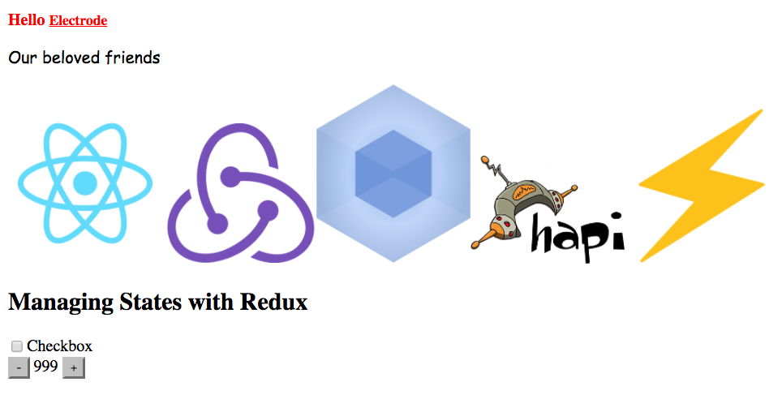

# 构建你的 Electrode 应用

你现在可以基于生成的 Electrode 应用开始构建你的应用了，打开下面这个文件：

`<electrode-app>/src/client/components/home.jsx`:

粘贴以下内容：

```js
import React from "react";
import PropTypes from "prop-types";
import { connect } from "react-redux";
import { toggleCheck, incNumber, decNumber } from "../actions";
import "../styles/home.css";

export const imageUrls = [
  "http://daynin.github.io/clojurescript-presentation/img/react-logo.png",
  "https://raw.githubusercontent.com/reactjs/redux/master/logo/logo.png",
  "http://freevector.co/wp-content/uploads/2014/04/webpack.png",
  "https://raw.github.com/hapijs/hapi/master/images/hapi.png",
  "https://upload.wikimedia.org/wikipedia/commons/thumb/d/d0/Emoji_u26a1.svg/2000px-Emoji_u26a1.svg.png"
];

class Home extends React.Component {
  renderImage(imageUrl, key) {
    return ;
  }

  render() {
    const props = this.props;
    const { checked, value } = props;
    return (
      <div>
        <h1>
          Hello <a href={"https://github.com/electrode-io"}>{"Electrode"}</a>
        </h1>
        <div>
          {" "}
          <p>Our beloved friends</p>
        </div>
        <div className="images">
          {imageUrls.map((imageUrl, index) =>
            this.renderImage(imageUrl, index)
          )}
        </div>
        <div>
          <h2>Managing States with Redux</h2>
          <label>
            <input
              onChange={props.onChangeCheck}
              type={"checkbox"}
              checked={checked}
            />
            Checkbox
          </label>
          <div>
            <button type={"button"} onClick={props.onDecrease}>
              -
            </button>
            &nbsp;{value}&nbsp;
            <button type={"button"} onClick={props.onIncrease}>
              +
            </button>
          </div>
        </div>
      </div>
    );
  }
}

Home.propTypes = {
  checked: PropTypes.bool,
  value: PropTypes.number.isRequired
};

const mapStateToProps = state => {
  return {
    checked: state.checkBox.checked,
    value: state.number.value
  };
};

const mapDispatchToProps = dispatch => {
  return {
    onChangeCheck: () => {
      dispatch(toggleCheck());
    },
    onIncrease: () => {
      dispatch(incNumber());
    },
    onDecrease: () => {
      dispatch(decNumber());
    }
  };
};

export default connect(
  mapStateToProps,
  mapDispatchToProps
)(Home);
```

然后添加一个新的样式文件 `<electrode-app>/src/client/styles/home.css` 并填写以下内容：

```css
h1 {
  font-size: 16px;
  color: red;
}

p {
  font-family: "Comic Sans MS", cursive, sans-serif;
}

a {
  font-size: 14px;
  color: red;
}

a:hover {
  color: blue;
}

.resource {
  margin-bottom: 10px;
}

.title {
  border-bottom: 2px solid blue;
  text-align: center;
}
```

启动开发服务：

```bash
clap dev
```

打开 [https://localhost:3000](https://localhost:3000]/).

> 如果你本身已经启动你开发服务，那么网页会自动刷新你的更新。

**The page should resemble the following screenshot:**


