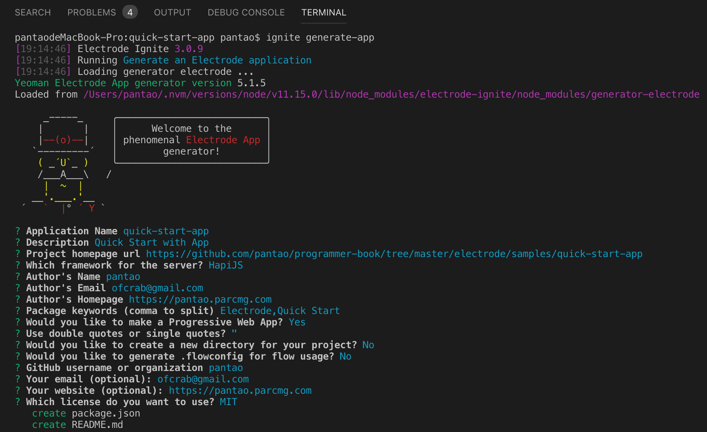
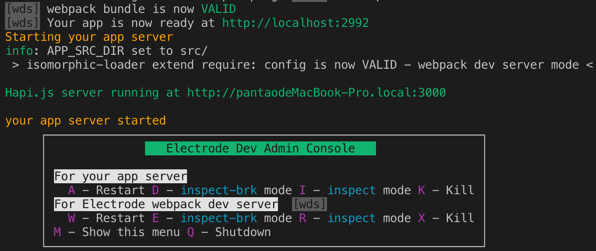
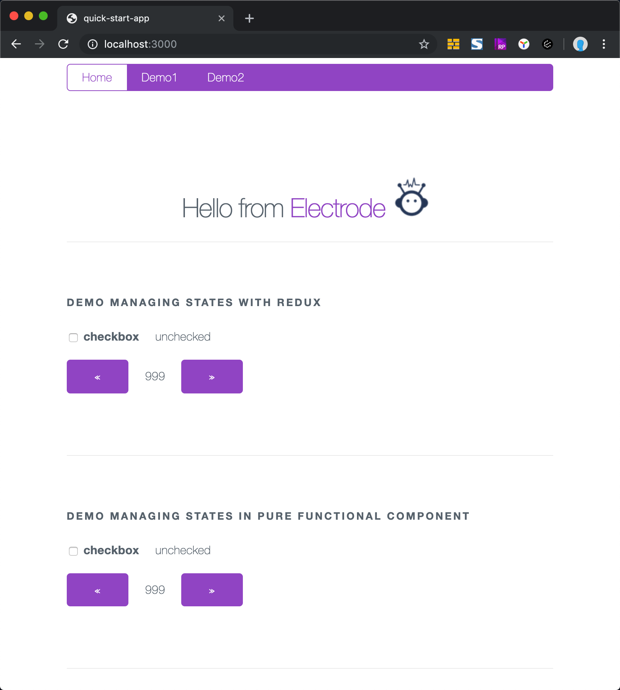

# 创建第一个 Electrode App

## 必备条件

在阅读本教程之前，请确认你已经具备了 [这些必备条件](../overview/requirements.md)

> _注意_：工作目录路径中不能出现空格：
>
> - 不支持： `c:\work space\electrode`
> - 支持： `c:\work_space\electrode`

## 快速指引

你可以使用 `ignite` 菜单 或者 `ignite` 指定命令方式开始你的开发。

- `ignite` 菜单

  ```bash
  ignite
  ```

- Ignite 指定命令： `Generate an Electrode application`

  ```bash
  ignite generate-app
  ```

除了为 App 指定一个名称外，其它所有操作均可选择默认项。

比如：



当创建完 App，且 `npm install` 执行完成之后，可以通过下面的命令启动开发服务：

```bash
cd quick-start-app
clap dev
```

当 App 启动成功之后，你会看到下面这样的内容



现在在浏览器中打开 [localhost:3000](http://localhost:3000/) 即可访问到你的 Electrode 应用。



你可以随意点击该应用上的链接或者顶部的导航链接，或者刷新页面，看看服务器端渲染的首屏代码。

## Additional Commands

要查看所有开发选项，输入以下命令：`clap`

提供热加载的开发环境：

```bash
clap hot
```

构建生产部署包：

```bash
clap build
```

以生产模式启动

```bash
npm run prod
```

---

## 项目结构

A basic top-level view of the application's structure is shown below.

```markdown
electrode-app
├── package.json
├── LICENSE
├── README.md
├── config
├── src
│   ├── client
│   └── server
├── test
│   ├── client
│   └── server
└── xclap.js
```

- `config` - 包含了项目的配置文档
- `src/client` - 包含 React 应用
- `src/server` - 包含提供 SSR 支持的 NodeJS 服务
- `test` - 包含所有单元测试
- `xclap.js` - Electrode archetype 的入口文件

生成的应用包含了一些示例组件以展示在你的应用中如何使用 Redux、CSS Modules、React JSX 等，这些示例内容可以随意的删除。

继续了解为你的应用开发可复用的组件，请阅读： [开发 Electrode 应用](../further-develop-app/build-app.md)。
