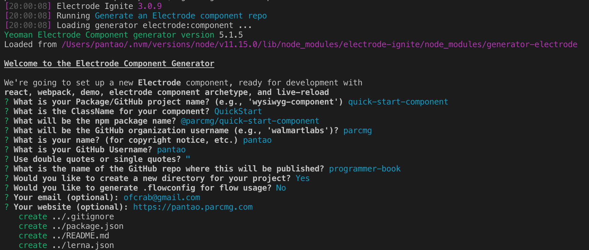
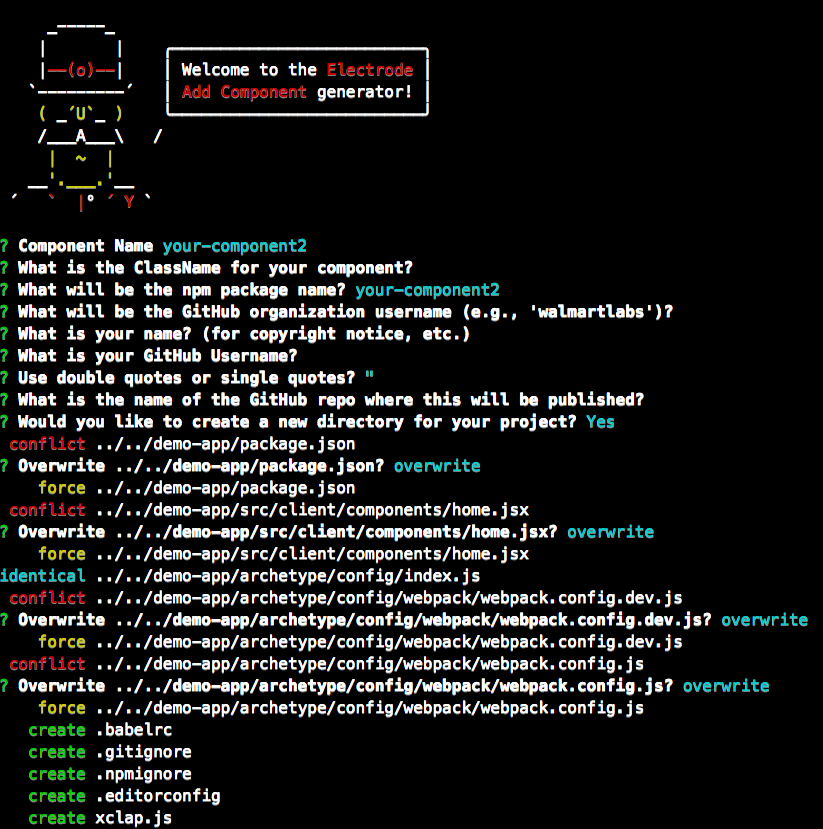

# 创建一个 Electrode 组件

> 在开始之前，请先确定你已经遵照 [必备条件](../overview/requirements.md) 指引设置好了你的开发环境。

## 快速指引

你可以使用 `ignite` 菜单 或者 `ignite` 指定命令方式开始你的开发。

- `ignite` 菜单

  ```bash
  ignite
  ```

- Ignite 指定命令： `Generate an Electrode application`

  ```bash
  ignite generate-component
  ```

除了为 App 指定一个名称外，其它所有操作均可选择默认项。

比如：



当安装完成之后，你的 Electrode 组件即完成了。

## 示例与预览

你可以启动 `demo-app` 来预览你刚刚创建的新组件。

```bash
cd <your-component>/demo-app
clap dev
```

当 Component 启动之后，你会在终端里面看到相应的状态：


一个 Web 服务将监听 localhost:3000 你的新组件也会在 `demo-app/src/client/components/home.jsx` 中被使用，现在在浏览器中打开 [localhost:3000](http://localhost:3000/) 即可访问你的组件。


## 添加更多 Component 至 Packages

> 如果你不需要更多 扩展组件，那么可以直接跳过该部分

与添加组件一样，你同样可以使用 `ignite` 菜单选择添加组件，或者直接执行添加命令

> 请先确保你现在位于 `packages` 目录下

- Ignite 菜单

```bash
ignite
```

选择 `5. Add a component to your existing component repo`.

- 直接执行添加命令

```bash
ignite add-component
```

按引导添加完成新的组件



新的组件会被添加，同时， `demo-app` 同时会被更新，看到全体冲突时都不要着急， `demo-app/src/client/components/home.jsx` 与 `demo-app/package.json` 在更新过程中都会被重写。

> 如果你安装了 `yo` 2.0.0 或更高的版本，你可以选择 `a` 选项以 `overwrite this and all others` （重写所有）或者 `y` 以表示每一次都需要确定是否 `overwrite`。

现在你可以通过 `demo-app` 预览多个组件了。

```bash
cd ../../demo-app/
clap dev
```

现在终端还是会展示状态信息。


打开 [localhost:3000](http://localhost:3000/) 预览组件


---

## 项目结构

```sh
electrode-component
    ├── demo-app
    │   ├── LICENSE
    │   ├── README.md
    │   ├── config
    │   ├── xclap.js
    │   ├── src
    │   │   ├── client
    │   │   └── server
    │   └── test
    │       ├── client
    │       └── server
    └── packages
        └── <componentName>
            ├── README.md
            ├── xclap.js
            ├── package.json
            ├── demo
            ├── src
            │   ├── components
            │   ├── index.js
            │   ├── lang
            │   └── styles
            └── test
                └── client
```

- `demo-app` - 一个用于测试与预览你所开发的 React 组件 `packages/<componentName>` 的 Electrode 应用，你需要在该示例应用中导入你的 `packages/<componentName>`
- `packages/<componentName>/xclap.js` - Electrode archetype tasks.
- `packages/<componentName>/demo` - 展示了如何为其他用户提供示例
- `packages/<componentName>/src` - Component 源码
- `packages/<componentName>/test` - Unit tests for your component.

要开发你的组件，请继续阅读 [开发 Electrode 组件](../further-develop-component/low-level-components.md)。
