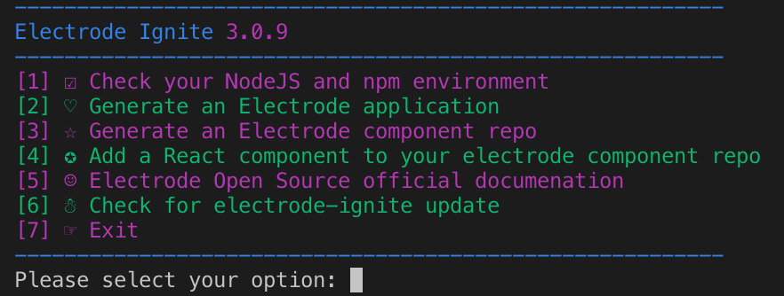
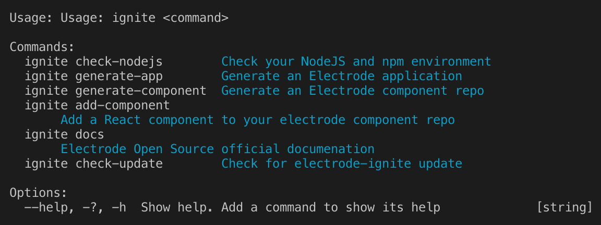

# 开始使用 Electrode Ignite

Electrode 是一个管理着很多元素与环境变量的平台，要保证所有部件都能工作在一起，我们提供了一个名为 [electrode-ignite] 的命令行工具，它将是你开发 Electrode 应用的唯一入口。

## 安装

> 在开始之前，请先确定你已经遵照 [必备条件](../overview/requirements.md) 指引设置好了你的开发环境。

## 使用

你可以简单的执行 `ignite` 命令即可开启其内置的菜单，根据菜单引导执行具体的操作，或者也可以直接指定具体需要执行的操作。

执行 `ignite --help` 可以列出所有支持的命令

### Ignite 菜单

执行以下命令打开 Ignite 菜单

```bash
ignite
```

Ignite 菜单如下图所示：



### 执行 Ignite 命令

如果在 `ignite` 后面带上一个表示具体命令的参数，那么 ignite 将不再打开菜单，而是直接执行它，比如下面我们将检测 NodeJS 环境：

```bash
ignite check-nodejs
```

生成一个新的 Electrode 应用

```bash
ignite generate-app
```

列出帮助列表：

```bash
ignite --help
```

比如：



## 可用的 Ignite 任务

- `check-nodejs` - 检测 NodeJS 环境
- `generate-app` - 生成一个 Electrode 应用
- `generate-component` - 生成一个 Electrode 组件
- `add-component` - 为当前的组件添加一个新子组件
- `docs` - Electrode 官方文档
- `help` - 展示帮助文档

现在让我们在接下来的内容里面使用 Ignite 开发 Electrode 应用与组件。

[electrode-ignite]: https://www.npmjs.com/package/electrode-ignite
